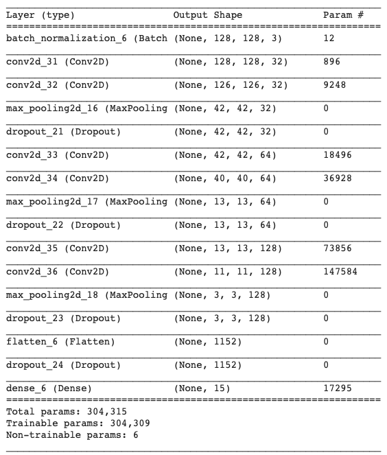

### Objective
Image classification of subclasses of Food, Flowers and Animals

Classes : ​['donuts', 'salad', 'lasagna', 'pancakes', 'pizza', 'risotto', 'cat', 'dog', 'monkey',
'squirrel', 'daisy', 'dandelion', 'sunflower', 'rose', 'tulip'] 

### Training Dataset
[LINK](https://drive.google.com/drive/folders/18BhzbaE4ykJ5ntSqefs_bKMehyKxUuma?usp=sharing)

### CNN Architecture Used

### Libraries Used
- numpy
- scipy
- pandas
- scikit-learn
- opencv-contrib-python 
- tensorflow
- keras

**For Implementation refer [notebook](notebook.ipynb)**

Training Accuracy Achieved: 70%
